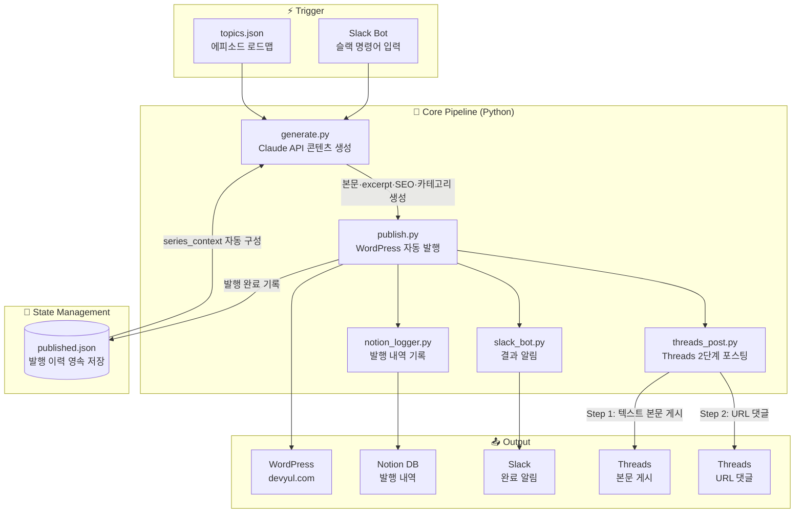

# 📝 devYul Blog Automation : Claude API 기반 블로그 자동화 파이프라인


<br>

## 💡 프로젝트 배경

**"글 하나 쓰는 데 2시간, 발행하는 데 30분."**

기술 블로그를 운영하면서 콘텐츠 생성 → 발행 → SNS 포스팅 → 기록까지의 반복 작업이
부업의 병목이 된다는 걸 깨달았습니다.

Claude API를 핵심 엔진으로, WordPress·Slack·Notion·Threads를 하나의 파이프라인으로 연결하여
**Slack 명령 한 번으로 블로그 발행까지 완전 자동화**한 시스템을 구축했습니다.

> **🔄 2026-07 v2 전환:** Claude API 직접 호출(토큰 종량제)을 걷어내고, **Claude Code가 글을 직접 작성**한 뒤
> 드래프트 파일(`drafts/epNN.json` + `epNN.html`)을 발행 스크립트에 넘기는 구조로 리팩토링했습니다.
> 글 생성 비용 0원 + 발행 전 원고 검토 가능. 아래 v1 아키텍처 설명은 히스토리로 유지합니다.

> 블로그 주제: *개발자가 AI 자동화로 부업하는 실전 기록*  
> 운영 블로그: [devyul.com](https://devyul.com)

<br>

## 🏛️ System Architecture



> **흐름 요약:** Slack 명령 → topics.json 로드 → Claude API 생성 → WordPress 발행 → Threads + Notion + Slack 알림

<br>

## 📁 프로젝트 구조 (v2)

```
blog-automation/
├── src/
│   ├── publish_draft.py   # 메인 진입점 — 드래프트 발행 파이프라인
│   ├── publish.py         # WordPress REST API 발행 (JWT)
│   ├── threads_post.py    # Threads 2단계 자동 포스팅
│   ├── notion_logger.py   # 발행 이력 Notion DB 기록
│   └── wp_series.py       # WP 발행 글 목록 조회 유틸
├── drafts/                # Claude Code가 작성한 원고 (epNN.json + epNN.html)
├── data/
│   ├── topics.json        # 에피소드 로드맵 (발행 순서 관리)
│   └── published.json     # 발행 이력 영속 저장 (중복 방지)
├── legacy/                # v1 (Claude API 호출 기반 generate.py, slack_bot.py)
├── WRITING_GUIDE.md       # 글쓰기 페르소나·스타일·HTML 템플릿 가이드
├── CLAUDE.md              # Claude Code용 매일 발행 워크플로우
└── .gitignore
```

### v2 파이프라인

```
Claude Code 세션: topics.json + published.json 읽고 다음 에피소드 글 작성
    ↓  drafts/epNN.html (본문) + drafts/epNN.json (메타·Threads 훅)
python src/publish_draft.py drafts/epNN.json
    ↓
WordPress 발행 → published.json 갱신 → Notion 기록 → Threads 포스팅
```

<br>

## 🔥 Core Technical Challenges

<br>

### 1. 중복 발행 버그 — 영속 상태 관리로 해결

**🔴 Problem**  
초기에는 발행 여부를 코드 내 리스트(`_PUBLISHED`)에 하드코딩하여 관리했습니다.  
프로세스가 재시작될 때마다 리스트가 초기화되어 **이미 발행된 글이 다시 발행되는 버그** 발생.

**🟢 Solution**  
발행 이력을 `data/published.json` 파일로 영속 저장하는 방식으로 전환.  
발행 시마다 파일에 기록하고, 실행 시작 시 파일을 읽어 중복 여부를 검증.

```
실행 시작
    ↓
published.json 로드
    ↓
이미 발행된 에피소드? ──Yes──→ 스킵
    ↓ No
Claude API 생성 → 발행 → published.json 업데이트
```

<br>

### 2. 시리즈 맥락(Context) 자동 구성

**🔴 Problem**  
블로그가 시리즈 형태로 운영되기 때문에, 새 글 생성 시 **이전 에피소드 내용을 Claude에게 전달**해야 일관성 있는 글이 작성됨.  
매번 수동으로 이전 글 내용을 정리하는 건 자동화 취지에 어긋남.

**🟢 Solution**  
`published.json`에 저장된 발행 이력을 읽어 `series_context`를 자동으로 구성.  
Claude API 호출 시 이전 에피소드 요약을 프롬프트에 자동 삽입하여 **시리즈 일관성 유지.**

```python
# published.json → series_context 자동 구성
series_context = build_context_from_published(published_data)
prompt = f"{series_context}\n\n이번 에피소드: {topic}"
```

<br>

### 3. Yoast SEO 자동화

**🔴 Problem**  
WordPress 발행 후 Yoast SEO 플러그인의 메타 디스크립션·포커스 키워드를 수동으로 설정해야 했음.  
매 발행마다 반복되어 자동화의 빈틈이 됨.

**🟢 Solution**  
Claude API가 본문 생성 시 메타 디스크립션·포커스 키워드도 함께 생성.  
WordPress REST API + Yoast SEO 메타 필드를 통해 발행과 동시에 SEO 정보 자동 세팅.  
카테고리도 ID 매핑 테이블로 자동 분류.

| 카테고리 | ID |
|---|---|
| AI 자동화 부업 | 2 |
| 개발 실전 기록 | 3 |
| 수익화 전략 | 4 |

<br>

### 4. Threads API URL 정책 제한 — 2단계 포스팅으로 해결

**🔴 Problem**  
Threads API는 본문에 URL을 포함할 경우 게시가 차단되거나 제한되는 정책이 존재.  
블로그 URL을 본문에 직접 삽입하는 방식으로는 안정적인 자동화 불가.

**🟢 Solution**  
본문 게시와 URL 첨부를 2단계로 분리하는 방식으로 전환.

```
Step 1: Claude Haiku가 생성한 훅(Hook) 텍스트만 본문으로 게시 (URL 없음)
    ↓ 성공 시
Step 2: 블로그 URL을 댓글(Reply)로 추가
    ↓ Step 2 실패해도 Step 1 결과는 성공으로 처리
```

**추가 설계 포인트**
- 본문 생성에는 **Claude Haiku** 사용 — 짧은 텍스트 생성에 비용 효율적인 모델 선택
- HTML 태그 제거(`_strip_tags`) 후 블로그 본문 앞 500자만 요약 입력으로 전달
- 숫자 + 대비 구조의 훅 퍼스트 포맷으로 생성 (예: `"자동화 2주 했더니\n\n방문자: 극소수\n수익: 0원\n후회: 없음"`)
- Step 2 실패는 별도 로깅하되 전체 파이프라인에 영향 없도록 예외 처리

> **배운 점:** 외부 플랫폼 API는 정책 변경 리스크가 항상 존재한다.  
> 핵심 기능(본문 게시)과 부가 기능(URL 첨부)을 분리 설계하면 일부 실패가 전체를 중단시키지 않는다.

<br>

## 🚀 Features

| 기능 | 내용 |
|---|---|
| **콘텐츠 자동 생성** | topics.json 로드맵 기반 Claude API 본문·excerpt·SEO 메타 자동 생성 |
| **WordPress 자동 발행** | REST API로 카테고리·태그·Yoast SEO까지 한 번에 발행 |
| **시리즈 맥락 유지** | published.json 기반 series_context 자동 구성으로 에피소드 일관성 보장 |
| **중복 발행 방지** | published.json 영속 저장으로 재실행 시 중복 발행 원천 차단 |
| **Threads 2단계 포스팅** | 본문(Claude Haiku 생성) + URL 댓글 분리로 API 정책 우회 |
| **Notion 발행 기록** | 발행 이력 자동 저장 및 콘텐츠 캘린더 관리 |
| **Slack 알림** | 발행 완료 시 슬랙으로 결과 보고 |

<br>

## 📸 실행 결과

> 📌 발행된 블로그 포스트


> 📌 Threads 포스팅 결과


> 📌 Notion 발행 이력 DB


> 📌 Slack 명령 및 결과 알림


<br>

## ⚙️ Getting Started

### 1. 레포지토리 클론
```bash
git clone https://github.com/devYul/blog-automation.git
cd blog-automation
```

### 2. 의존성 설치
```bash
pip install requests python-dotenv
```

### 3. 환경변수 설정 (.env)

| 변수명 | 설명 |
|---|---|
| `ANTHROPIC_API_KEY` | Claude API 키 |
| `WP_URL` | WordPress 사이트 URL |
| `WP_USER` | WordPress 사용자명 |
| `WP_APP_PASSWORD` | WordPress Application Password |
| `SLACK_BOT_TOKEN` | Slack Bot Token |
| `NOTION_TOKEN` | Notion API Integration Key |
| `NOTION_DB_ID` | 발행 이력을 저장할 Notion DB ID |
| `THREADS_ACCESS_TOKEN` | Threads API Access Token |
| `THREADS_USER_ID` | Threads 사용자 ID |

### 4. 실행 (v2)

Claude Code 세션에서 "오늘 글 써서 발행해줘"라고 하면 `CLAUDE.md` 워크플로우에 따라
원고 작성 → 발행까지 수행합니다. 수동 실행은:

```bash
python src/publish_draft.py drafts/ep23.json           # 발행 + 이력 + Notion + Threads
python src/publish_draft.py drafts/ep23.json --draft   # WP draft로만 (검토용)
```

<br>

## ⚙️ Environment Variables

보안을 위해 모든 인증 토큰은 `.env` 파일로 분리하여 관리합니다.  
`.gitignore`에 `.env`가 포함되어 있어 토큰이 원격 저장소에 노출되지 않습니다.
